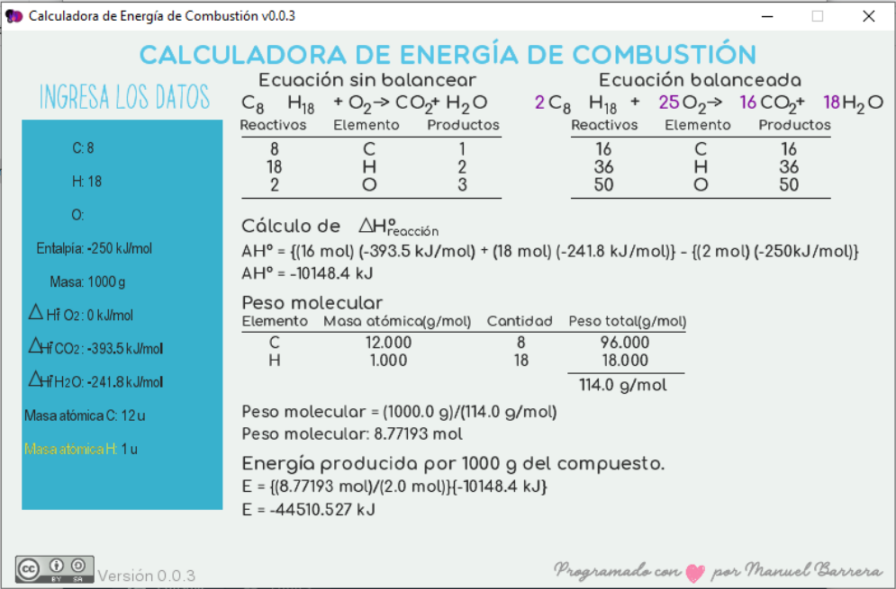

# Calculadora de Energía de Combustión :fire:

¡Calcula la energía de combustión de diferentes compuestos!

La versión actual es la _0.0.3_ y esta permite el balanceo y cálculo de la energía de combustión de:

- Alcanos
- Alquenos
- Alquinos

# Uso

El programa solamente acepta **números**, **.** (punto), **-** (signo menos) y las flechas **UP**, **DOWN** y **LEFT**.

Con la tecla **UP** y **DOWN** selecciona el campo donde quieras escribir. El campo seleccionado se coloreará de amarillo. Si quieres borrar un campo desplazate hasta él y presiona la tecla **LEFT**.

___
___

#### Próximas versiones

La nomenclatura de versión a seguir es:

- **X.0.0**: Actualizaciones considerables de la interfaz e incorporación de herramientas para el usuario o desarrollador.
- **0.X.0**: Incorporación de elementos, grupos funcionales, etc.
- **0.0.X**: Depuración y optimización del código.

## Licencia
[CC BY-SA 4.0](https://creativecommons.org/licenses/by-sa/4.0/ "Licencia")

___
___

La aplicación está desarrollada con _Processing_.

#ProgramandoUnMundoLibre

@hadachantel :palm_tree:
